# Sick Children's Trust

[View the live site here](https://mrst12.github.io/sick-childrens-trust-portfolio/)

[View my Github here](https://github.com/Mrst12/sick-childrens-trust-portfolio)

## Final Design
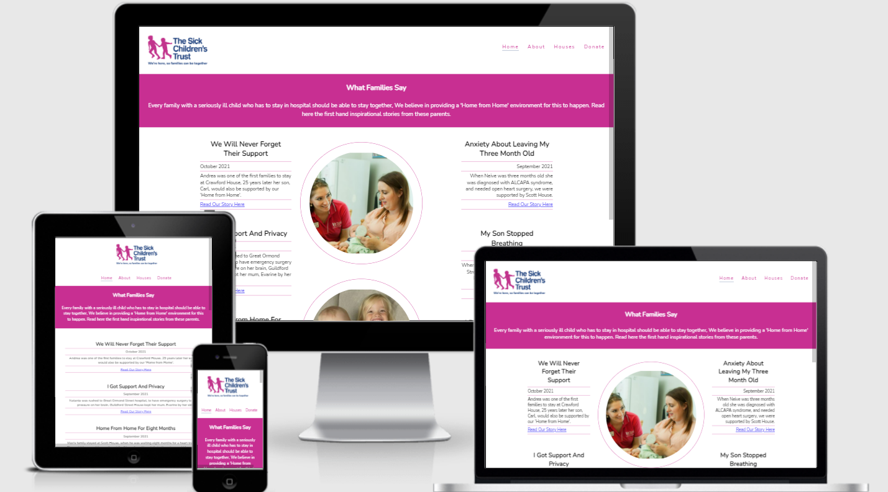

## Introduction

In August 2013 My nearly two year old daughter needed open heart surgery at Leeds General Infirmary, to save her life. She was born with Tetrology of Fallots, she underwent her first heart surgery at 8 weeks old where they fitted a temporary shunt.
She then needed a second life saving operation and at this time we lived in Lincolnshire, over 80 miles away from the hospital, we were offered a place to stay at Eckersley house in Leeds, a 2 minute walk to the hospital, this house was run by a charity called the Sick Children's Trust, it allows families of sick children to stay close to the hospital in a 'home from home' environment.
We had never even heard of the Sick Children's trust let alone it's houses, needless to say we spent a great amount of time there, and was overwhelmed by the generosity and support given to us during such a difficult time.
We spent the whole day at my daughters bedside in intensive care, then high dependancy, followed by a main ward, to be able to have somewhere to go at night to have a shower, have a meal, have a comfortable room to relax in and have some downtime in, really helped us cope and be on hand should we be needed.
It was one act of kindness that will never be forgotten from the Sick Children's Trust.
The aim of this website is to raise the profile of the Sick Children's Trust and broaden the scope to show people they are there if they should ever need their help, also most importantly give something back.

## CONTENTS
- [User Experience](#user-experience-ux)
    - [User Stories](#user-stories)
- [Design](#design)
    - [Colour Scheme](#colour-scheme)
    - [Typography](#typography)
    - [Images](#images)
- [Wireframes](#wireframes)
- [Features](#features)
- [Technologies Used](#technologies-used)
    - [Languages](#languages)
    - [Programmes Used](#programmes-used)
- [Testing](#testing)
    - [Lighthouse](#lighthouse)
    - [Devices](#devices)
    - [Testing User Stories](#testing-user-stories)
    - [Known Bugs](#known-bugs)
    - [Functionality](#functionality)
- [Deployment](#deployment)
    - [Forking The Repository](#forking-the-repository)
    - [Cloning The Repository](#cloning-the-repository)
- [Credits](#credits)
    - [Code](#code)
    - [Acknowledgements](#acknowledgements)

## User Experience (UX)

- ### User Stories
    
        1. As a user, I want to easily navigate around the website.
        2. As a user, I want the content to be easily understandable and relevant.
        3. As a user, I want to know that the company is trustworthy, and genuine via other users testimonials.
        4. As a user, I want to see the social side of the company with links to their pages.

- ### Design
    - #### Colour Scheme
        - There are 3 main colours used throughout the site to reflect the actual Sick Children's Trust website
        These are:
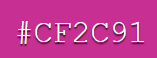
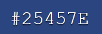

- ### Typography
    - The typography used throughout the site is Nunito font, with a backup of sans-serif, should it fail. I used this as it is then the same font as the Sick Children's Trust website.
    - The text colour used is also the same as the Trust's site which is
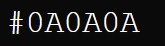

- ### Images
    - The images used have been taken off the Sick Children's website, and are related to the content of the page.
    
#### Wireframes
    
[Desktop wireframe for the homepage](./assets/wireframes/home-desktop.png)

[Tablet/mobile wireframe for the homepage](./assets/wireframes/home-tablet-mobile.png)

[Desktop wireframe for the about page](./assets/wireframes/about-desktop.png)

[Tablet/mobile wireframe for the about page](./assets/wireframes/about-tablet-mobile.png)

[Desktop wireframe for the houses page](./assets/wireframes/houses-desktop.png)

[Tablet/mobile wireframe for the houses page](./assets/wireframes/houses-tablet-mobile.png)

[Desktop wireframe for the donate page](./assets/wireframes/donate-desktop.png)

[Tablet/mobile wireframe for the donate page](./assets/wireframes/donate-tablet-mobile.png)
    
## Features

- The site consists of 4 pages: **Home**, **About**, **Houses**, and **Donate**, there is also an additional **Thankyou page**.
- Each page has a consitent design **Nav-bar with logo**, **Top paragraph bar**, **Footer containing social links and copyright**
- Interactive navigational bar
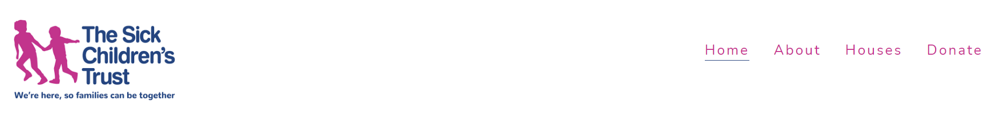
- The logo on the left will also take you back to the home page from any of the pages.
- The nav-bar has a line under to show which page you are on, and also contains a hover effect.
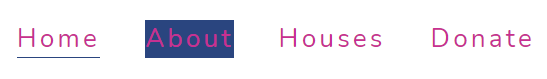
- Interactive footer will take you directly to the social sites of the Sick Children's Trust.
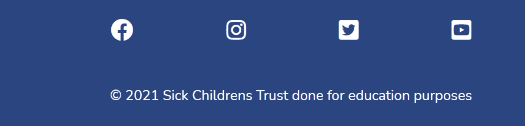
- The Home page has links to the full testimonial stories on the Sick Children's Trust.
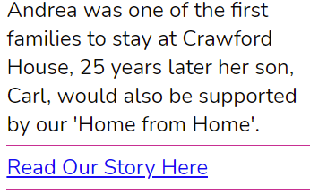
- The Houses page has links to each of the different houses on the Sick Children's website so more information can be gained. Each link is colour coded the same as the map.
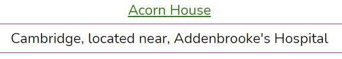
- The Donate page will take you to a thankyou page when you click the donate button.

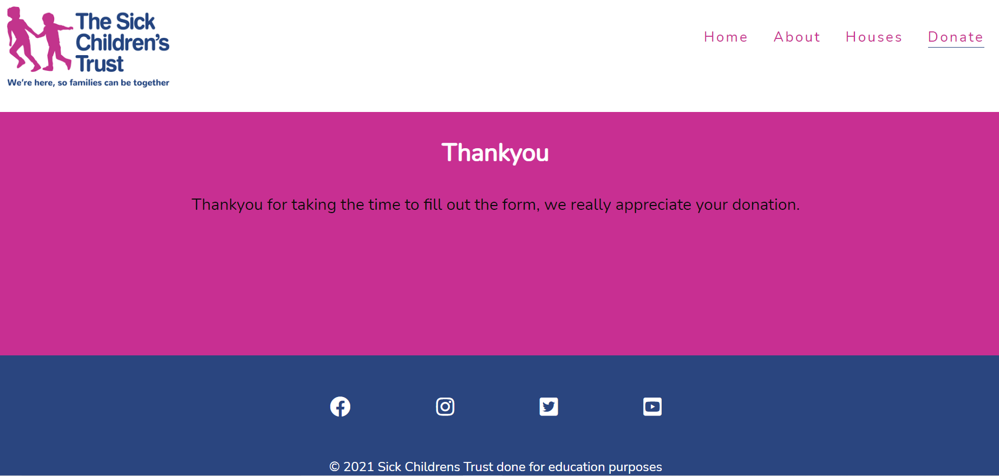

## Technologies used
### Languages

- HTML
- CSS
### Programmes used
- Balsamiq
    - For the wireframes.
- Git
    - For version control, commiting and pushing to Github.
- Github
    - For storing the repository, files and images pushed from Gitpod.
- Gitpod
    - IDE used to code the website.
- Chrome developer tools
    - For checking compatibilty, troubleshooting and editing code.
- Am I responsive
    - Used to test responsiveness of the website at different screen sizes.
- Google Fonts
    - Used for the font of the website.

## Testing
The W3C Markup Validator and W3C CSS Validator Services were used to validate every page of the project to ensure there were no syntax errors in the project.
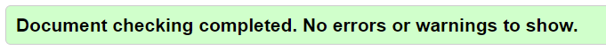
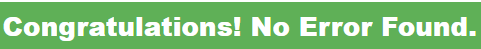

### Lighthouse
- The site was tested through Lighthouse
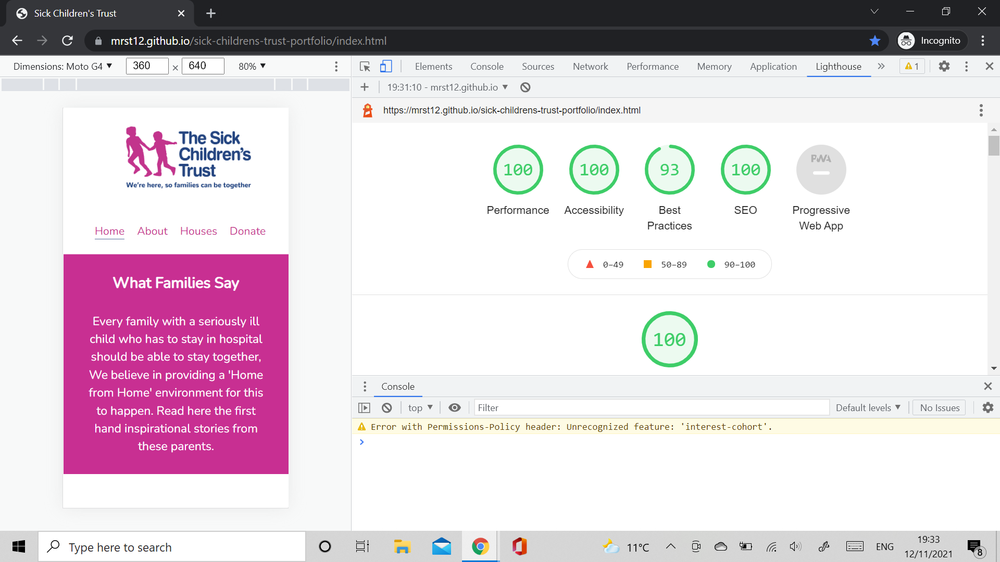

### Devices
- The site was tested on **Chrome**, **Safari**, and **Edge**.
- It was tested on an iphone 7, and ipad, as well as my desktop computer.

### Testing User Stories
- 1. As a user, I want to easily navigate around the website.
    - The top navigational bar is clear and uncluttered for easy navigation, and
    is the same on every page.
- 2. As a user, I want the content to be easily understandable and relevant.
    - The content is kept to a minimum and links to the proper Sick Children's Trust website
    so users can choose the content.
- 3. As a user, I want to know that the company is trustworthy, and genuine via other users testimonials.
    - The Home page is testimonials for the Sick Childrens Trust, with links to the genuine stories.
- 4. As a user, I want to see the social side of the company with links to their pages.
    - The footer on each page has links to the social media side of the Sick Children's Trust.

### Known bugs
- The lighthouse report threw up an error 'Displays images with incorrect aspect ratio'
    - This is relating to the logo, I tried to resize the image, but lighthouse kept changing the dimensions, when the correct ratio was reached the logo was out of place and the navigational bar didn't look right.
- On mobile devices like iphone the images are slightly to the right, tried to correct on developer tools, but it didnt look right.

### Functionality
- All links have been tested and are accessible.
- All links open in a new page so users can return to the main site.
- All links have been hovered over to test they work.
- All images load as intended.

## Deployment
- The project was deployed to Github pages using the following steps:
1. Log into Github and locate the [Github repository](https://github.com/Mrst12/sick-childrens-trust-portfolio).
2. Click on the settings icon at the top of the repository.
3. Scroll down until you come to the Github pages section
    - On this part it says it now has it's own dedicated tab and to click check it out click this.
4. Where it says **source** select **main**, next to this should say root.
5. Click save, then refresh the page.

### Forking the repository
1. Log into the Github repository.
2. Underneath your avatar is a button labelled **Fork**, click this.
3. You should have your own copy now.

### Cloning the repository
1. Log into Github and locate the repository.
2. Under the repository name click the button labelled **code**.
3. You will see an option to clone or download.
4. Copy the url for cloning by clicking the clipboard icon.
5. Launch gitpod or your own choice of directory.
6. Open Gitbash
7. Change the current working directory to the location you want the cloned directory to be.
8. Type git clone and paste the Url from step 4. 
9. Press enter to create the cloned directory.
## Credits

### Code
- [Sick Children's Trust Website](https://www.sickchildrenstrust.org/)
    - For content, and images. This site is linked via my site. Permission was gained via email to access and use the material.
- [W3schools](https://www.w3schools.com/)
    - For more indepth explanations of HTML and CSS
- Love running project was my initial inspiration, but the styling changed as my confidence grew with layout structures.

### Acknowledgements:
- Code institute for course material and content
- Everybody on the slack community for support, advice, guidance and patience.
- My mentor for assistance and advice on planning and final submission feedback.
- My husband and children for their patience, support and understanding.

