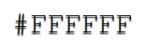

# Sick Children's Trust

[View the live site here](https://mrst12.github.io/sick-childrens-trust-portfolio/)

[View my Github here](https://github.com/Mrst12/sick-childrens-trust-portfolio)

## Final Design

## Introduction

In August 2013 My nearly two year old daughter needed open heart surgery at Leeds General Infirmary, to save her life. She was born with Tetrology of Fallots, she underwent her first heart surgery at 8 weeks old where they fitted a temporary shunt.
She then needed a second life saving operation and at this time we lived in Lincolnshire, over 80 miles away from the hospital, we were offered a place to stay at Eckersley house in Leeds, a 2 minute walk to the hospital, this house was run by a charity called the Sick Children's Trust, it allows families of sick children to stay close to the hospital in a 'home from home' environment.
We had never even heard of the Sick Children's trust let alone it's houses, needless to say we spent a great amount of time there, and was overwhelmed by the generosity and support given to us during such a difficult time.
We spent the whole day at my daughters bedside in intensive care, then high dependancy, followed by a main ward, to be able to have somewhere to go at night to have a shower, have a meal, have a comfortable room to relax in and have some downtime in, really helped us cope and be on hand should we be needed.
It was one act of kindness that will never be forgotten from the Sick Children's Trust.
The aim of this website is to raise the profile of the Sick Children's Trust and broaden the scope to show people they are there if they should ever need their help, also most importantly give something back.

## User Experience (UX)

- ### User Stories
    
        1. As a user, I want to easily navigate around the website.
        2. As a user, I want the content to be easily understandable and relevant.
        3. As a user, I want to know that the company is trustworthy, and genuine via other users testimonials.
        4. As a user, I want to see the social side of the company with links to their pages.

- ### Design
    - #### Colour Scheme
        - There are 3 main colours used throughout the site to reflect the actual Sick Children's Trust website
        These are:

- ### Typography
    - The typography used throughout the site is Nunito font, with a backup of sans-serif, should it fail. I used this as it is then the same font as the Sick Children's Trust website.
    - The text colour used is also the same as the Trust's site which is

- ### Images
    - The images used have been taken off the Sick Children's website, and are related to the content of the page.
    
#### Wireframes
    
[Desktop wireframe for the homepage](./assets/wireframes/home-desktop.png)

[Tablet/mobile wireframe for the homepage](./assets/wireframes/home-tablet-mobile.png)

[Desktop wireframe for the about page](./assets/wireframes/about-desktop.png)

[Tablet/mobile wireframe for the about page](./assets/wireframes/about-tablet-mobile.png)

[Desktop wireframe for the houses page](./assets/wireframes/houses-desktop.png)

[Tablet/mobile wireframe for the houses page](./assets/wireframes/houses-tablet-mobile.png)

[Desktop wireframe for the donate page](./assets/wireframes/donate-desktop.png)

[Tablet/mobile wireframe for the donate page](./assets/wireframes/donate-tablet-mobile.png)
    
## Features

- The site consists of 4 pages: **Home**, **About**, **Houses**, and **Donate**, there is also an additional **Thankyou page**.
- Each page has a consitent design **Nav-bar with logo**, **Top paragraph bar**, **Footer containing social links and copyright**
- Interactive navigational bar

- The logo on the left will also take you back to the home page from any of the pages.
- The nav-bar has a line under to show which page you are on, and also contains a hover effect.

- Interactive footer will take you directly to the social sites of the Sick Children's Trust.

- The Home page has links to the full testimonial stories on the Sick Children's Trust.

- The Houses page has links to each of the different houses on the Sick Children's website so more information can be gained. Each link is colour coded the same as the map.

- The Donate page will take you to a thankyou page when you click the donate button.

## Technologies used
### Languages

- HTML
- CSS
### Programmes used
- Balsamiq
    - For the wireframes.
- Git
    - For version control, commiting and pushing to Github.
- Github
    - For storing the repository, files and images pushed from Gitpod.
- Gitpod
    - IDE used to code the website.
- Chrome developer tools
    - For checking compatibilty, troubleshooting and editing code.
- Am I responsive
    - Used to test responsiveness of the website at different screen sizes.
- Google Fonts
    - Used for the font of the website.

## Testing

## Deployment
## Credits